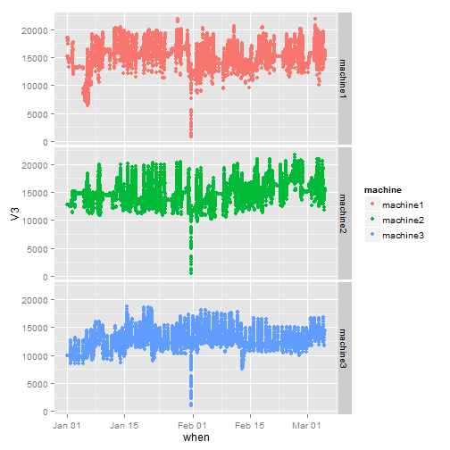

## Our Initial Problem

- Applications hosted on virtual machines
- Initial estimate of how much memory we needed per hosted application was somewhat high
- Wanted data to narrow down what the requirements really are

--- .class #id 

## Action

- We decided to collect data on memory in active use
- Using memstat
- Output looks like this:

2015-01-01 00:00:01 18312 11779

2015-01-01 00:01:01 18360 11730

2015-01-01 00:02:01 18414 11677

2015-01-01 00:03:01 18431 11659

2015-01-01 00:04:01 18433 11657

2015-01-01 00:05:01 18436 11654

...

---

## Data

 

---

## Results

1. Maximum memory used was lower than expected
2. Able to reclaim resources and save money
3. Reports tell which machine has head-room to put another app on

---

## Amusing side effects

- Other data patterns noted were:
*  characteristic down-and-then-up of restarting an application
*  very large dips identify when the machines were rebooted

 

